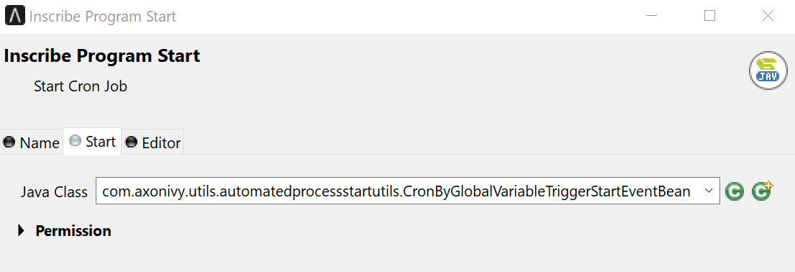
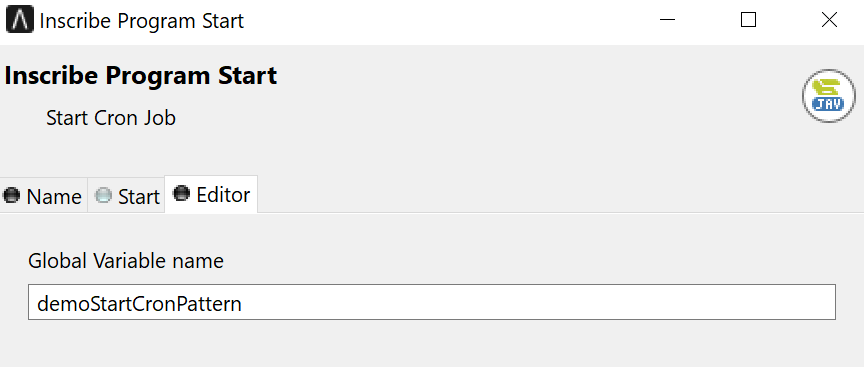

# Cron Job Utils

**Cron Job Utils** is a job-firing schedule that recurs based on calendar-like notions.

The [Quartz framework](http://www.quartz-scheduler.org/) is used as underlying scheduler framework.

With Cron Job Utils, you can specify firing-schedules such as “every Friday at noon”, or “every weekday and 9:30 am”, or even “every 5 minutes between 9:00 am and 10:00 am on every Monday, Wednesday and Friday during January”.

For more details about Cron Expressions please refer to [Lesson 6: CronTrigger](http://www.quartz-scheduler.org/documentation/quartz-2.3.0/tutorials/tutorial-lesson-06.html)

## Demo

In this demo, the CronByGlobalVariableTriggerStartEventBean is defined as the Java class to be executed in the Ivy Program Start element.



This bean gets a cron expression via the globale variable defined as Cron expression and it will schedule by using the expression.



For this demo, the Cron expression is defining the time to start the cron that simply fires every 5 seconds.

```

  demoStartCronPattern: 0/5 * * * * ?

```

## Setup

No special setup is needed for this demo. Only start the Engine and watch out the logging which will be updated every 5 seconds with the following logging entry:

```

Cron job ist started at: 2023-01-27 10:43:20.

```
