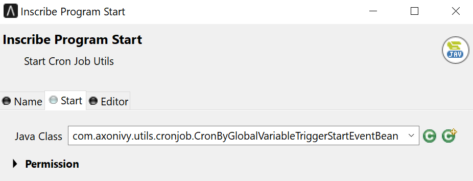

# Cron Job

A Cron Job is a recurring schedule for executing tasks. With a Cron Job, you can set schedules like "every Friday at 12:00 PM," "every weekday at 9:30 AM," or even "every 5 minutes between 9:00 AM and 10:00 AM on every Monday, Wednesday, and Friday in January."

The [Quartz framework](http://www.quartz-scheduler.org/) is used as the underlying scheduler framework.

You can find more details about Cron Expressions here: [Lesson 6: CronTrigger](http://www.quartz-scheduler.org/documentation/quartz-2.3.0/tutorials/tutorial-lesson-06.html)

## Demo

In this demo, the CronByGlobalVariableTriggerStartEventBean is defined as the Java class to be executed in the Ivy Program Start element.



This bean gets a cron expression via the variable defined as Cron expression and it will schedule by using the expression.


For this demo, the Cron expression is defining the time to start the cron that simply fires every 5 seconds.

```

  demoStartCronPattern: 0/5 * * * * ?

```

## Setup

No special setup is needed for this demo. Only start the Engine and watch out the logging which will be updated every 5 seconds with the following logging entry:

```

Cron Job is started at: 2023-01-27 10:43:20.

```
